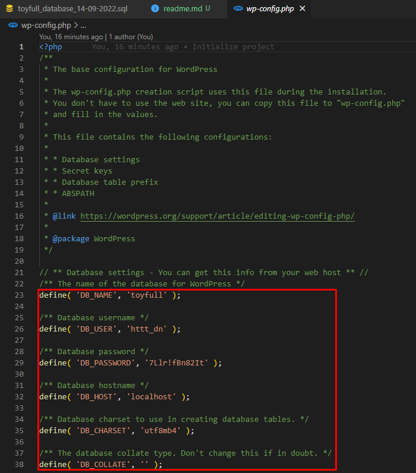

## Cách cấu hình project ##
- Clone project vào thư mục **htdocs** (nếu sử dụng xampp) hoặc thư mục **www** (nếu sử dụng laragon).
- Sau khi clone về máy tính cá nhân, xem các cấu hình trong file wp-config.php để sử dụng cấu hình database như hình bên dưới:

	- Trong phpmyadmin, tạo người dùng theo trong file wp-config.php:
		- Username: `httt_dn`
		- Password: `7Llr!fBn82It`
		- Host: `localhost`
	- Tạo database: `toyfull` với charset là `utf8mb4`
- Sau khi tạo trong database, import file database trong project.
> Lưu ý: Mỗi khi clone project mới về, cập nhật lại database gần nhất để tránh xảy ra lỗi.
- Account đăng nhập (http://toyfull.test/wp-login.php):
	- Superadmin: Superadmin - 123
	- Shop Manager: shop_manager - htttdn123
	- Customer: customer - htttdn123